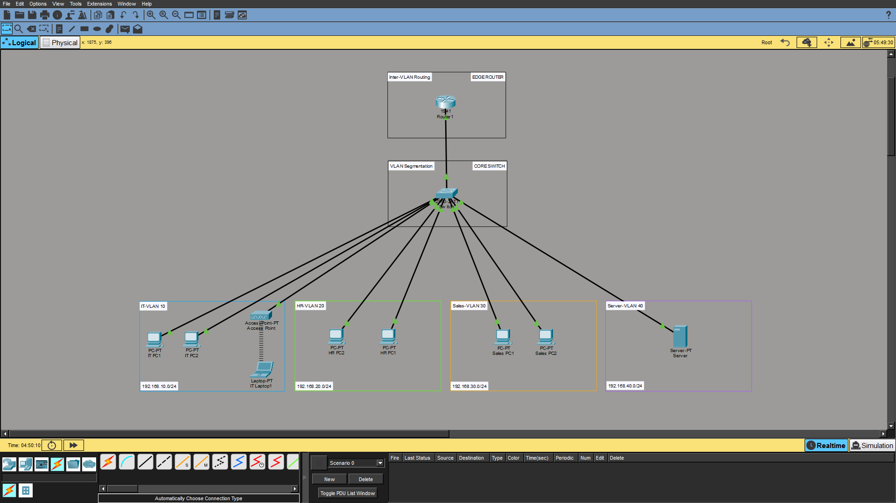
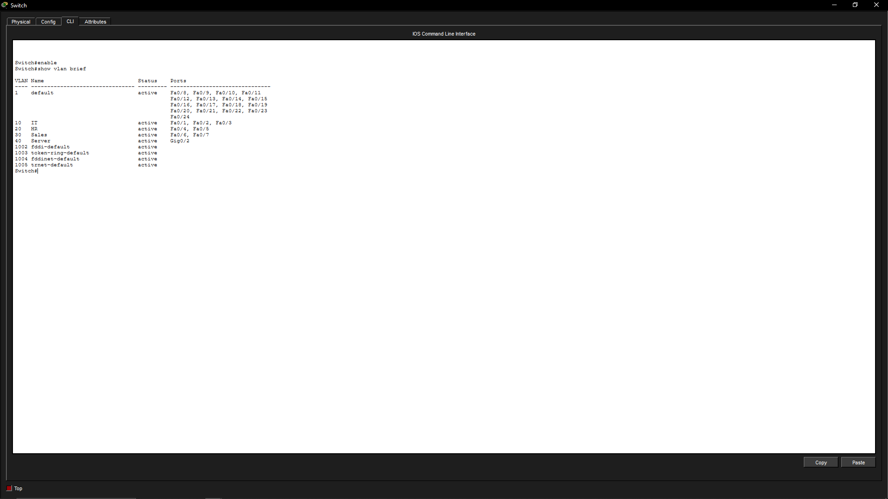
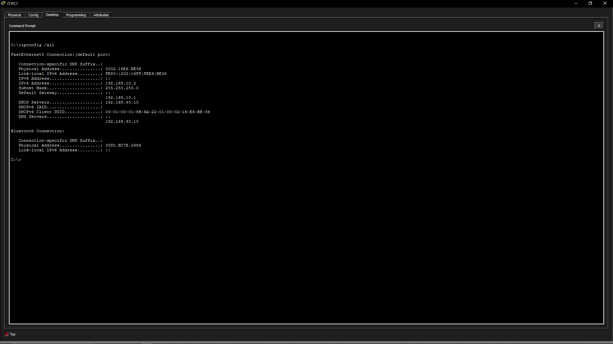
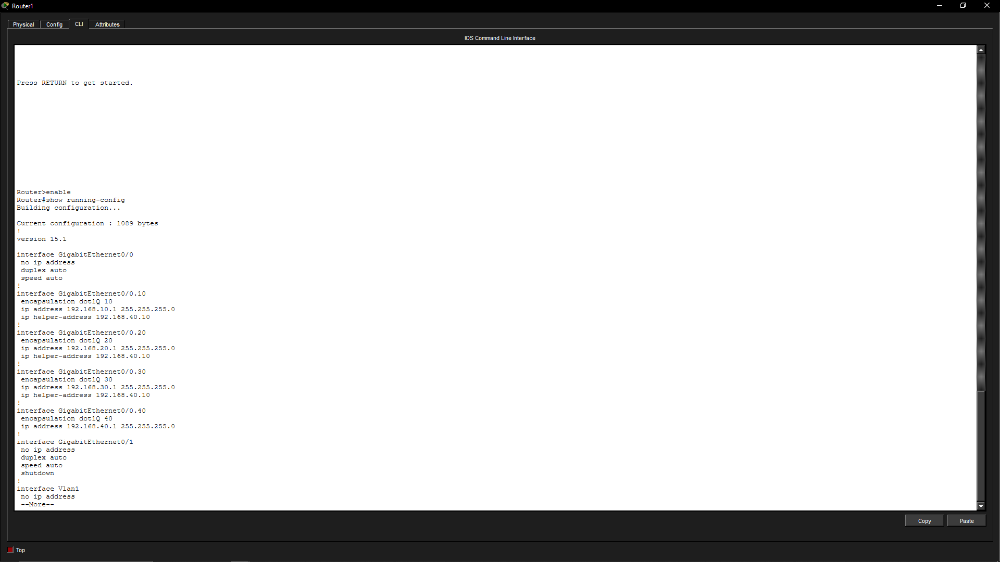
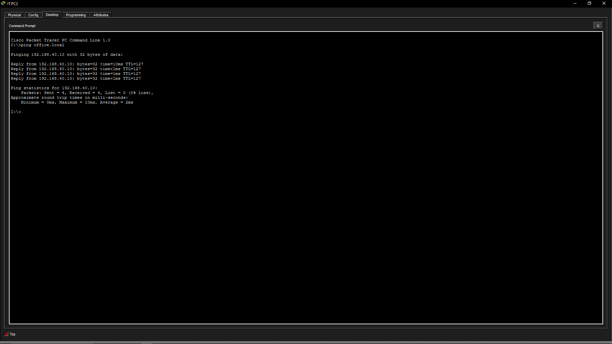
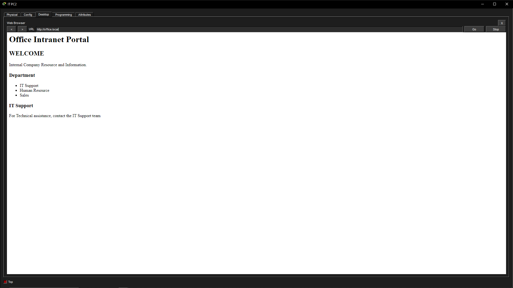

# Office Network Simulation — Cisco Packet Tracer

A small office network simulation built in Cisco Packet Tracer to practice practical networking and L1 IT support troubleshooting.

## Project Overview

Designed and configured a small office network with separate VLANs for IT, HR, and Sales, along with a dedicated server VLAN.

The network provides DHCP, DNS, and an internal HTTP intranet portal, with wireless access through an Access Point.

## Network Design

| Network | VLAN | Subnet | Gateway |
|---|---:|---|---|
| IT | 10 | 192.168.10.0/24 | 192.168.10.1 |
| HR | 20 | 192.168.20.0/24 | 192.168.20.1 |
| Sales | 30 | 192.168.30.0/24 | 192.168.30.1 |
| Server | 40 | 192.168.40.0/24 | 192.168.40.1 |

## Devices

- Cisco 1941 Router
- Cisco 2960 Switch
- Server
- Access Point
- IT workstations
- HR workstations
- Sales workstations
- Wireless laptop

## Configured Services

### VLANs
Created separate VLANs for IT, HR, Sales, and the Server network.

### Inter-VLAN Routing
Configured Router-on-a-Stick using 802.1Q subinterfaces to allow communication between VLANs.

### DHCP
Configured the server as the DHCP server for the IT, HR, and Sales networks.

DHCP relay was configured on the router using `ip helper-address`.

### DNS
Configured an internal DNS A record:

`office.local → 192.168.40.10`

### HTTP
Configured an internal office intranet portal hosted on the server and accessed by client PCs using:

`http://office.local`

### Wireless
Configured an Access Point for wireless access to the IT network.

## Testing & Verification

The network was tested using:

- `ipconfig /all`
- `ping`
- DNS hostname resolution
- Browser access to the internal intranet
- DHCP address assignment
- Inter-VLAN connectivity

## Screenshots

### 1. Network Topology

### 2. VLAN Configuration

### 3. DHCP Client Configuration

### 4. Inter-VLAN Routing

### 5. DNS Resolution

### 6. Internal Intranet Portal

## Skills Demonstrated

- Cisco Packet Tracer
- Computer Networking
- VLANs
- IP Addressing
- Subnetting
- Inter-VLAN Routing
- DHCP
- DNS
- HTTP
- Wireless Networking
- Network Troubleshooting
